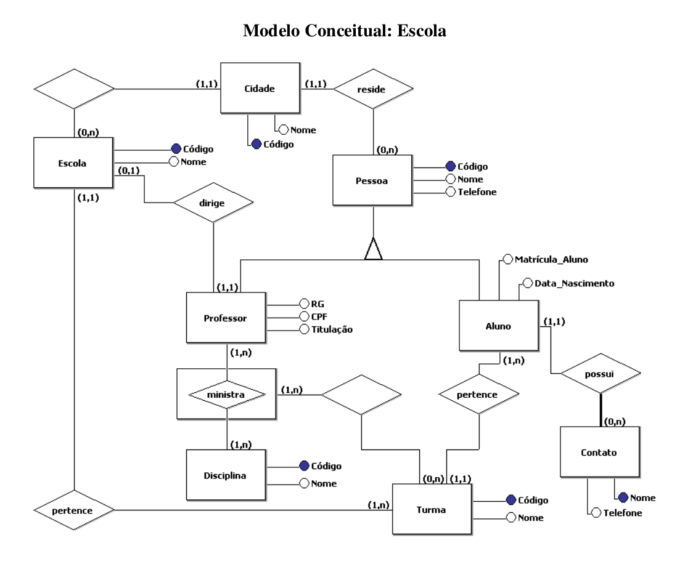
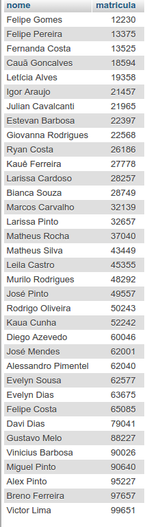
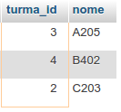
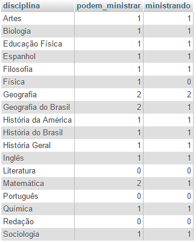
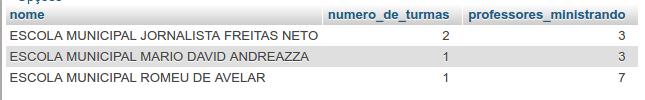
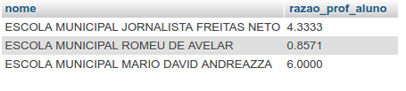
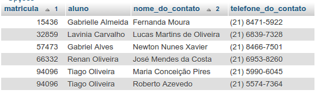

# TRABALHO BD



### Consultas


- 1) Listar o nome e a cidade das escolas onde todos os alunos residam na mesma cidade onde a escola está localizada.

```sql

SELECT e.nome Escola, c.nome Cidade
FROM cidade c, escola e
WHERE NOT EXISTS(
		SELECT 1
    FROM aluno a, turma t, pessoa p
    WHERE a.turma_id = t.turma_id AND a.aluno_id = p.pessoa_id AND t.escola_id = e.escola_id AND e.cidade_id != p.cidade_id  
	  ) AND e.cidade_id = c.cidade_id

```


---

- 2) Listar o nome e matrícula dos alunos sem nenhum contato cadastrado.

```sql
SELECT nome, matricula
FROM pessoa p, aluno a
WHERE matricula NOT IN (
   SELECT matricula
   FROM aluno a, contato c
   WHERE a.aluno_id = c.aluno_id
) AND pessoa_id = aluno_id
```



---


- 3) Listar o código e nome das turmas com mais de 5 alunos.

```sql
SELECT t.turma_id, t.nome
FROM aluno a, turma t
WHERE a.turma_id = t.turma_id
GROUP BY t.nome
HAVING COUNT(a.matricula) > 5
```


---
- 4) Listar o código, nome e titulação dos professores que ministram aulas para pelo menos três turmas diferentes.

```sql
SELECT p.professor_id, nome, p.titulacao
FROM ministra_turma m, professor p, pessoa
WHERE p.professor_id = pessoa_id AND p.professor_id = m.professor_id  
GROUP BY p.professor_id
HAVING COUNT(DISTINCT m.turma_id) >= 3
```


---

- 5) Listar por disciplina o número de professores que podem ministrá-la e quantos efetivamente ministram a mesma para uma turma.
```sql
SELECT d.nome nome_disciplina, COUNT(DISTINCT p.professor_id) podem_ministrar, temp.ministrando
FROM professor p
  JOIN professor_disciplina pd
    ON p.professor_id = pd.professor_id
  JOIN disciplina d
    ON pd.disciplina_id = d.disciplina_id
  JOIN (
    SELECT mt.disciplina_id, COUNT(DISTINCT p.professor_id) ministrando
    FROM professor p
      LEFT JOIN ministra_turma mt
        ON p.professor_id = mt.professor_id
    GROUP BY mt.disciplina_id) temp
   ON temp.disciplina_id = d.disciplina_id
   GROUP BY nome_disciplina
```



---

- 6) Listar o nome da escola e o nome dos diretores de escola que residem em cidades diferentes da cidade da escola.

```sql

SELECT e.nome nome_escola, pe.nome diretor
FROM pessoa pe, escola e, professor p
WHERE e.diretor_id = p.professor_id
AND pe.pessoa_id = p.professor_id
AND e.cidade_id != pe.cidade_id

```


---

- 7) Listar por escola o número de turmas e o número de professores que ministram alguma disciplina para turmas da escola em questão.

```sql
SELECT e.nome, COUNT(t.turma_id) numero_de_turmas, temp.professores_ministrando
FROM turma t JOIN escola e on t.escola_id = e.escola_id JOIN (
        SELECT e.escola_id id_da_escola, COUNT(DISTINCT p.professor_id) professores_ministrando
        FROM professor p
        JOIN ministra_turma mt
        	ON p.professor_id = mt.professor_id
        JOIN turma t
        	ON t.turma_id = mt.turma_id
        JOIN escola e
        	ON e.escola_id = t.escola_id
        GROUP BY id_da_escola) temp
    ON id_da_escola = e.escola_id
    GROUP BY e.nome
```



---

- 8) Listar por escola a razão entre o número de alunos da escola e o número de professores que ministram alguma disciplina na escola em questão.

```sql
SELECT e.nome, ( temp.qtd_alunos / COUNT(DISTINCT p.professor_id) ) razao_prof_aluno
FROM professor p JOIN ministra_turma mt
	ON p.professor_id = mt.professor_id
JOIN turma t
	ON t.turma_id = mt.turma_id
JOIN escola e
	ON e.escola_id = t.escola_id
JOIN (SELECT esc.escola_id, COUNT(DISTINCT a.aluno_id) qtd_alunos
		FROM aluno a JOIN turma t
      		ON t.turma_id = a.turma_id
		JOIN escola esc
      		ON esc.escola_id = t.escola_id
		GROUP BY esc.escola_id) temp
    ON temp.escola_id = e.escola_id
GROUP BY e.escola_id

```



---

- 9) Listar todos os contatos dos alunos informando a matrícula e nome do aluno, nome e telefone do contato, ordenado por matrícula do aluno e nome do contato.

```sql
SELECT a.matricula, p.nome aluno, p.nome nome_do_contato, c.telefone telefone_do_contato
FROM pessoa p, aluno a, contato c
WHERE a.aluno_id = c.aluno_id AND p.pessoa_id = a.aluno_id
ORDER BY a.matricula, nome_do_contato
```


---

- 10) Listar todos os professores que ministram disciplinas para apenas uma turma.

```sql
SELECT pessoa.nome
FROM pessoa, professor p, ministra_turma m
WHERE p.professor_id = m.professor_id AND pessoa.pessoa_id = p.professor_id
GROUP BY pessoa.nome
HAVING COUNT(DISTINCT m.turma_id) = 1
```


---

### Update

- 1) Alterar todos os contatos vinculados a um aluno A para um aluno B.

```sql

UPDATE contato c
SET c.aluno_id = 22
WHERE c.aluno_id = 17

```


- 2)

```sql
/* remover professor ID = 1*/
UPDATE escola
SET diretor_id = 8
WHERE diretor_id = 1;

/* remove o professor especificado*/
DELETE FROM professor
WHERE professor_id = 1;

```

---

#### Outras consultas que utilizamos ao longo do trabalho

- Quantidade de alunos por turma

```sql
 SELECT COUNT(a.matricula), t.nome
 FROM aluno a, turma t
 WHERE a.turma_id = t.turma_id
 GROUP BY t.nome

 ```


- Mostrar todos os alunos que tem contato

``` sql

SELECT nome, matricula
FROM pessoa,(
 SELECT a.aluno_id, matricula
 FROM aluno a, contato c
 WHERE a.aluno_id = c.aluno_id
 ) r
WHERE pessoa_id = r.aluno_id

```

- Quantidade de alunos por escola

```sql

SELECT e.nome nome_da_escola, COUNT(DISTINCT a.aluno_id) qtd_alunos
FROM aluno a JOIN turma t ON t.turma_id = a.turma_id
JOIN escola e ON e.escola_id = t.escola_id
GROUP BY nome_da_escola
```
